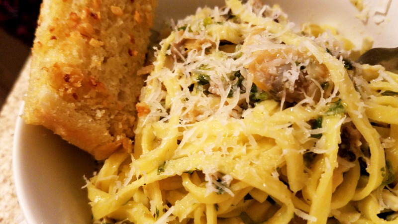
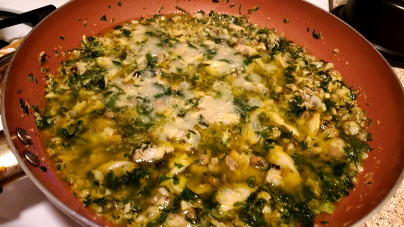
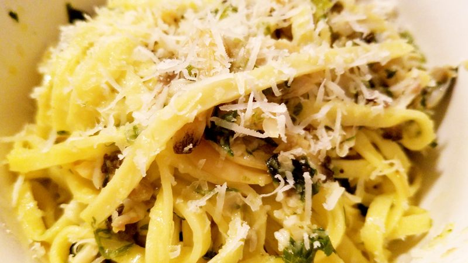

# Clam Sauce

## Keith Ratner

This recipe ultimately calls for clam meat. This can be sourced from fresh clams, but it's much less labor-intensive to get pre-packaged clam meat. Most recently, I discovered a local Vietnamese supermarket which has everything: pre-packaged frozen clam meat as well as fresh clams.

- 1-2 lbs. Fresh Clams (optional)
- 1/2 lb. Clam Meat
- 6-8 fresh garlic cloves, finely chopped/minced
- 1 bunch Italian parsley, leaves finely chopped
- 1/4 cup extra virgin olive oil
- 1/4 cup clam juice (either jarred or derived from fresh clams)
- 1/2 cup white wine, either cooking wine or Chardonnay (optional)
- 2 tablespoons sea salt (optional)
- 2 tablespoons red pepper (optional)
- 1 lb. pasta (linguine, angel hair, or pappardelle)
- 2-3 tablespoons shredded parmesan/asiago/romano cheese (optional)

## Fresh Clams

> If you're using fresh clams, this process will yield clam juice which you can use in the sauce.

Half-fill a large pot with the fresh clams (shells unopened). Quarter-fill the pot with filtered water. Add 2-3 tablespoons of minced garlic and 3 tablespoons of extra virgin olive oil. Simmer the clams on low heat for 30-45 minutes until the shells open. Try not to overcook.

Utilize the resulting liquid for the clam juice.

## Pasta

Traditionally, linguine has been the pasta of choice. However, this works great with angel hair. Most recently, I've been using pappardelle.

Whichever pasta you choose, start cooking it first. You will be adding it in to the sauce once the sauce is ready, so it's best to get the pasta going early.

## Clam Sauce

In a large skillet, saute fresh garlic in 1/4 cup extra virgin olive oil. Simmer until the garlic just begins to brown.

Add in the finely chopped fresh parsley. While stirring the mixture with a wooden spoon, pour in some clam juice, roughly 1/4 cup. Continue stirring to mix the flavors. Keep simmering for 1-2 minutes.

Add in the red pepper if you're using it.

Add in the clam meat. Continue stirring. Add in the rest of the clam juice. If you're using white wine, go ahead and add it in now.

Continue stirring.

TASTE THE SAUCE. Adjust the flavoring accordingly. If you feel it needs some salt, add the sea salt now. Keep simmering.

The pasta should be ready. DO NOT DRAIN THE PASTA. Using tongs, pull the pasta out and add to the sauce.

Gently stir the pasta and clam sauce while continuing to simmer. Toss the pasta until it is evenly coated. Simmer for an additional minute.

Serve immediately. Optionally, top with shredded parmesan/asiago/romano cheese, but consider that the sauce should be naturally flavorful, even if you haven't added salt. The clam juice is saltwater. The cheese will add more saltiness.

If you steamed fresh clams, place some shelled clams around the plate. It's all in the presentation.

ENJOY!

