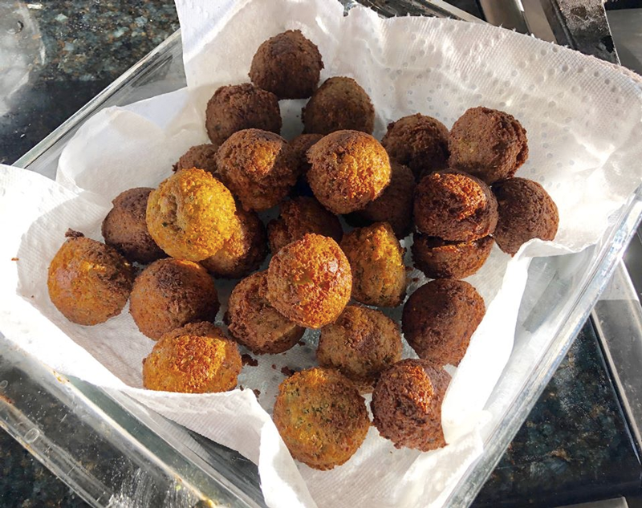

# Falafel

## Laura Dean Koch

My falafel recipe uses dry chickpeas that have been soaked and drained. I've tried using canned but the texture is too mushy, so take the extra time and use dried. These are deep fried, but if you have an air fryer that works too!

Laura’s Falafel

Yields: about 32 small falafel

Ingredients:

- Chickpeas 2 cups, measure after soaking dried
  chickpeas
- Onion 1 cup, rough chopped (½ large or 1 small)
- Garlic 2 to 4 cloves, pressed or chopped
- Fresh parsley 1 to 2 tablespoons, rough chopped
- Fresh cilantro 1 to 2 tablespoons, rough chopped
- Salt 1 teaspoon
- Red pepper flakes ½ to 1 teaspoon
- Cumin 1 heaping teaspoon
- Coriander 1 heaping teaspoon
- Black pepper ¼ teaspoon
- AP flour 3 tablespoons
- Baking powder ½ teaspoon
- Veg oil for frying

Method:

1. Soak dried chickpeas in an abundant amount of water overnight, or in a large saucepan cover chickpeas with water (2 inches above chickpeas), bring to a boil, then turn off heat, cover and allow to soak for several hours.
2. In a food processor or blender, combine drained chickpeas, onions, garlic, parsley, cilantro, salt, red pepper flakes, cumin, coriander, and black pepper. Process until the chickpeas are broken down (but not pureed) and the batter holds together.
3. Add the flour and baking powder and pulse just until combined. Place in a bowl, cover and refrigerate for a few hours (or overnight).
4. In a large saucepan heat 2 to 3 inches of oil to 375 degrees F. Using a small scooper (or two spoons to shape falafels) scoop and drop falafel into hot oil. Fry 6 to 8 falafel at a time (do not overcrowd the pan) a few minutes on each side until golden brown. Place cooked falafel in a paper towel lined dish.
